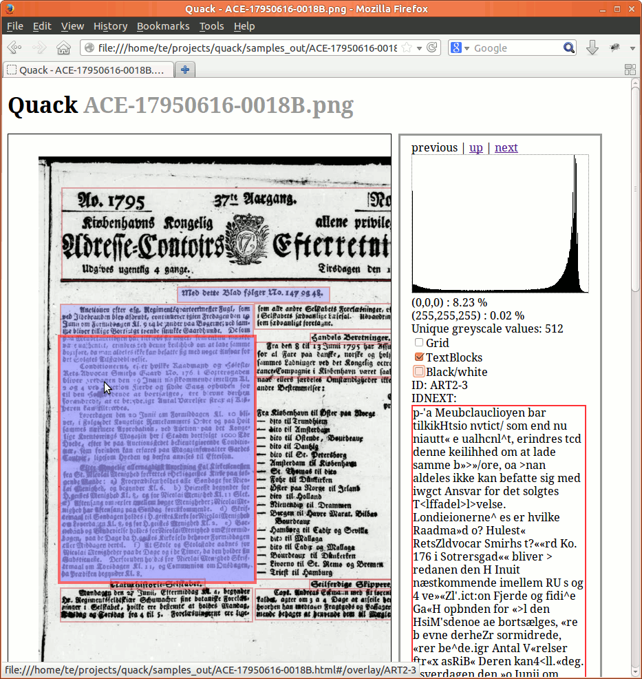

# Quack

An enhanced [ALTO](http://www.loc.gov/standards/alto/)-viewer for Quality Assurance oriented display of a collections of scans, typically from books or newspapers.

Please visit  [http://tokee.github.io/quack/](http://tokee.github.io/quack/) for the project homepage, featuring a live demo.

## Requirements

 * A minimum of 2GB free RAM for processing of 30MP scans
 * bash
 * [GraphicsMagic](http://www.graphicsmagick.org/)
 * [ImageMagick](http://www.imagemagick.org) (as GraphicsMagic cannot create histograms)
 * [openseadragon.min.js](http://openseadragon.github.io/)
 * A suitable beefy browser equipped machine for display, depending on image sizes and ALTO complexity
 * [deepzoom](http://search.cpan.org/~drrho/Graphics-DZI-0.05/script/deepzoom) (only if tile based display is enabled)
  * Perl (required by deepzoom)

## Usage

To get started, execute the following in a terminal (Tested under Linux, should work under OS-X and Cygwin):
  
  ./quack.sh samples samples_out
